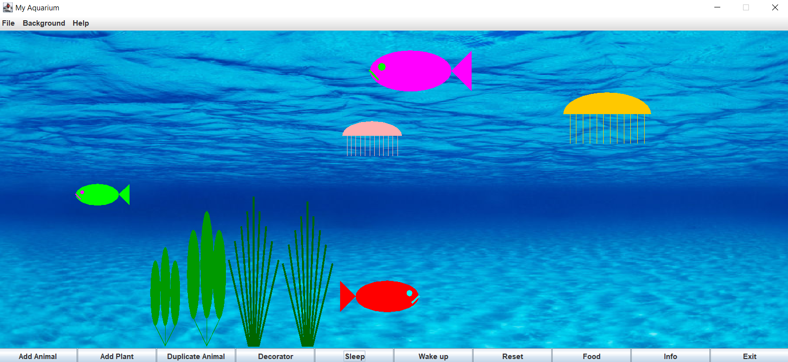
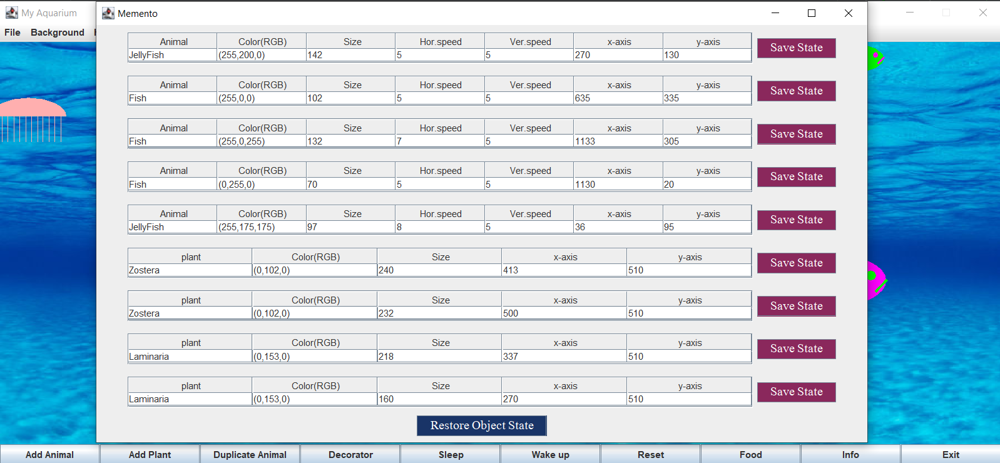
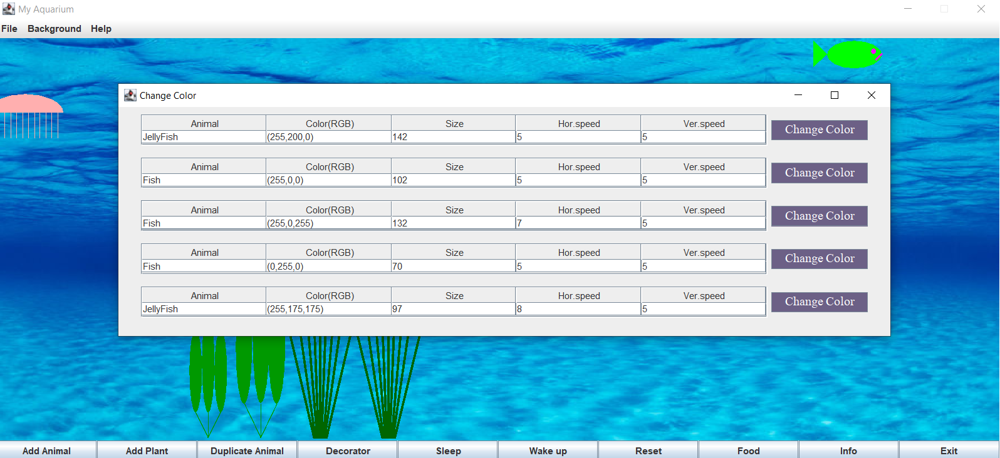
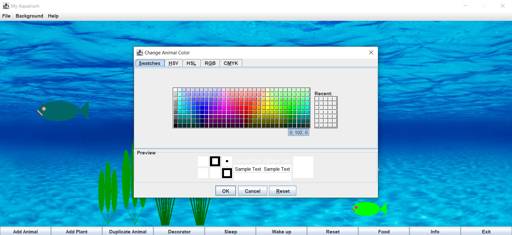
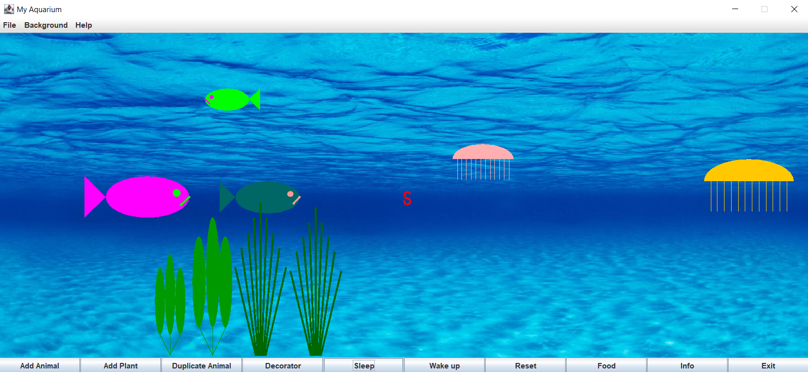
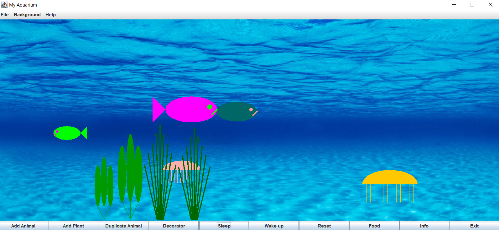
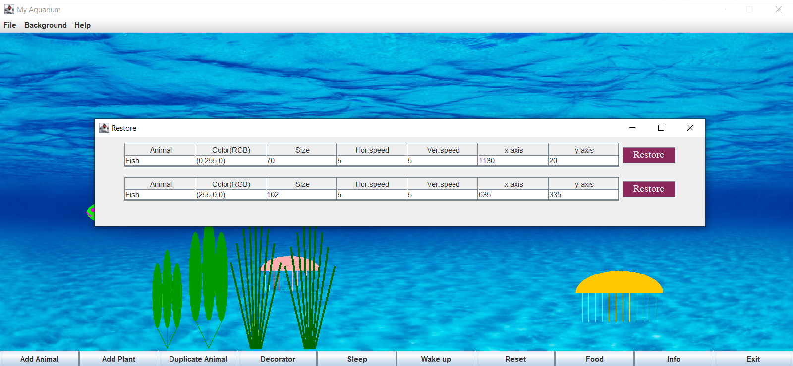
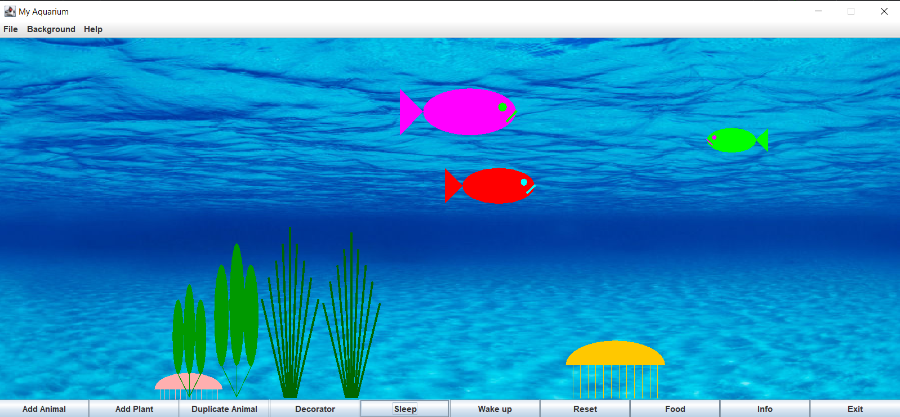

# Aquarium-Java

### Authors: 

* Afik Danan - afikdanan@gmail.com
* Topaz Aakal – topazaakal5@gmail.com

This is our final project in Advance oop course at Sami Shamoon Engineering College. 
At this project we created aquarium with the ability to add fish and jellyfish and some sea plant at the buttom of the aquarium.
Each fish and jellyfish are threads and they will swim around the panel. 

We implemented the following design pattrens: 

- Memento - to save the current state of the and jellyfish.
- Prototype - to create a creature from saved template and duplicate creatures.
- State - two states (Hungry, Satiated) to make the creature move towards the food if it hungry.
- Decorator - Change the color of a selected creature. 
- Abstract Factory - to create new instances of animal or plants (user choice).
- Singleton - to force only one instance of the worm (food).

### Few screenshots:  
For start we will add some animals and plants.

Now we will save some of the animals current state (size, location, speed and color) using Memento

After saving let's change te colors using our Decorator. Select animal

Select color.

Some fish are in Hungry state. Let's feed them.

Yum nice worm. The fish that got the worm change it state to Satiated

Time to restore the Saved animals.

All back as it was.

### Thank you

